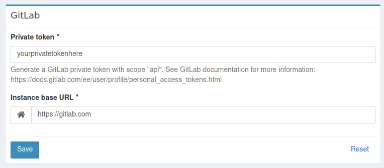
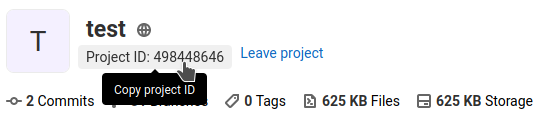
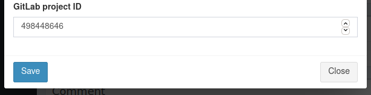
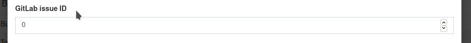
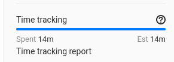

# GitLabBundle

A Kimai 2 plugin, which send duration of cards to GitLab spend issues of timesheet.

## Installation

First clone it to your Kimai installation `plugins` directory:
```
cd /kimai/var/plugins/
git clone https://github.com/LibreCode/GitLabBundle.git
```

And then rebuild the cache: 
```
cd /kimai/
bin/console cache:clear
bin/console cache:warmup
```

You could also [download it as zip](https://github.com/LibreCode/GitLabBundle/archive/master.zip) and upload the directory via FTP:

```
/kimai/var/plugins/
├── GitLabBundle
│   ├── GitLabBundle.php
|   └ ... more files and directories follow here ... 
```
## How to use?

### Configuring

#### GitLab settings

* Generate a GitLab private token with scope "api". See GitLab documentation for more information: https://docs.gitlab.com/ee/user/profile/personal_access_tokens.html
* Go to Settings > GitLab and fill private token and instance base URL:

  

#### Project settings

* Get the GitLab project id going to GitLab repository

  

* Edit or create a Kimai project associated to GitLab repository and fill the GitLab project ID:

  

  > PS: You only will see this field if you configure the GitLab private token

#### Associate specific timesheet to GitLab
* On create or edit form you will see the GitLab issue ID field:

  

  > PS: You only will see this field if you configure the GitLab private token

## Results

* After you save a entry on Kimai with GitLab issueId you will see the spend time on GitLab

  

## How it works?

When you do any of these actions:

* `TimesheetCreatePostEvent`
* `TimesheetUpdatePostEvent`
* `TimesheetDuplicatePostEvent`
* `TimesheetStopPostEvent`
* `TimesheetDeletePreEvent`

The plugin will identify if it has an issueId, having issueId a query will be performed to add the time spent of all records in the project that have an issueId equal to the issueId sent.

Two requests will be made to GitLab:
1. Reset time spent
2. Define the total time spent
